# インターバルタイマー PWA デザインドキュメント

## 1. 概要

ワークアウト（HIIT、タバタ、筋トレ等）で使うインターバルタイマーを、PWAとして実装する。オフラインでも動作し、スマートフォンのホーム画面から即座に起動できるアプリを目指す。

## 2. 背景と目標（WHY）

### 解決したい問題

ワークアウト中にインターバルを管理するのが困難。スマートフォンの時計アプリやストップウォッチでは、「作業→休憩→作業→...」のサイクルを自動で切り替えられない。既存のインターバルタイマーアプリはネイティブアプリが多く、インストールの手間がかかる。

### 目標（GSMフレームワーク）

- **Goal**: ブラウザからすぐ使えて、オフラインでも動作するインターバルタイマーを提供する
- **Signal**: ユーザーがタイマーを設定→開始→完了までの一連のフローを、ネットワーク切断状態でも問題なく実行できる
- **Metric**:
  - Lighthouse PWAスコア: 90点以上
  - タイマー開始までの操作ステップ: 3ステップ以内
  - オフライン動作: Service Worker登録後、ネットワーク切断でも全機能利用可能

## 3. 目標としないこと（Non-Goals）

- ユーザー認証・アカウント管理（データはローカルストレージに保存）
- ソーシャル機能（共有・ランキング等）
- ワークアウト履歴の詳細分析・グラフ表示
- Apple Watch等のウェアラブルデバイス対応
- バックエンドAPIによるデータ永続化（サーバーレスDBは使わない）

## 4. 提案する設計（HOW）

### アーキテクチャ概要

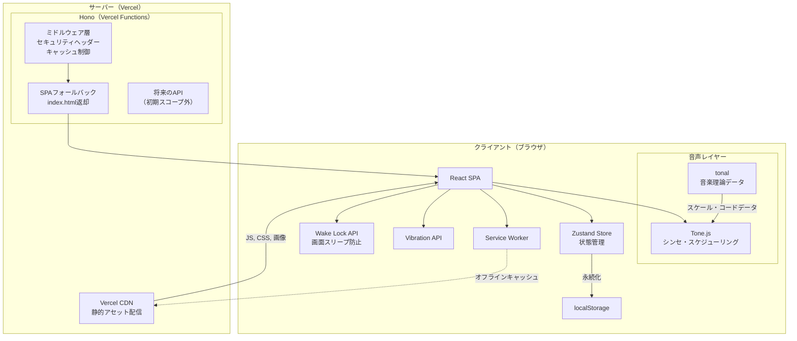

> **注意**: Vercelデプロイ時、Honoの`serveStatic()`は無視される（[Vercel公式](https://vercel.com/docs/frameworks/backend/hono)）。静的アセット配信はVercel CDNが担当し、Honoはミドルウェア層・SPAフォールバック・将来のAPIエンドポイントを担う。

### 技術スタック

| レイヤー | 技術 | 選定理由 |
|---|---|---|
| サーバー | Hono | ミドルウェア層（セキュリティヘッダー等）+ 将来のAPI拡張基盤。Vercel Functionsとして動作 |
| Vite統合 | @hono/vite-dev-server | 開発時のHMRとHonoミドルウェアを統合。本番同等の環境で開発可能 |
| 言語 | TypeScript（tsgo） | Go実装の高速TypeScriptコンパイラ。型チェック速度が従来のtscより大幅に高速。tsconfigは標準設定を使用 |
| UI | React | コンポーネント指向、宣言的UIで直感的 |
| UIコンポーネント | shadcn/ui | アクセシブルで美しいコンポーネント群。コードをプロジェクトにコピーする方式で、フルカスタマイズ可能。Radix UI + Tailwind CSSベース |
| 状態管理 | Zustand | 軽量で高速なストア。ボイラープレートが少なく、Reactフック形式でシンプルに使える。ストアの状態はZodスキーマで型安全に管理 |
| ビルド | Vite | HMR高速、React対応が優秀 |
| スタイリング | Tailwind CSS | shadcn/uiの基盤。ユーティリティファーストでデザイントークンの一元管理が容易 |
| アニメーション | @react-spring/web | スプリング物理ベースのアニメーション。SVGリング進行・フェーズ切替・数値カウントダウンを滑らかに制御。Zustandと同じpmndrsエコシステム |
| コード品質 | Biome | リンター＋フォーマッターを単一ツールで提供。ESLint + Prettierより高速で設定がシンプル |
| 音声生成 | Tone.js | Web Audio APIの高レベルラッパー。シンセ音生成・正確なスケジューリング・内蔵エフェクトを提供 |
| 音楽理論 | tonal | ノート・スケール・コード等の理論データ操作ライブラリ。ダイアトニック制約に基づく通知音の生成に活用 |
| エフェクト拡張 | Tuna.js（必要時） | Web Audio向けエフェクトライブラリ（Delay / Reverb / Chorus等）。Tone.js内蔵FXで不足時の追加パレット |
| 画面制御 | Wake Lock API | タイマー動作中の画面スリープ防止。ブラウザ標準APIを使用 |
| PWA | Vite PWA Plugin | Service Worker自動生成、マニフェスト管理 |
| デプロイ | Vercel | ゼロコンフィグ、静的アセットはCDN配信、Hono部分はVercel Functions |

### Honoの役割定義

Honoは**「薄いミドルウェアレイヤー + 将来の拡張ハブ」**として機能する。SSRは採用しない。

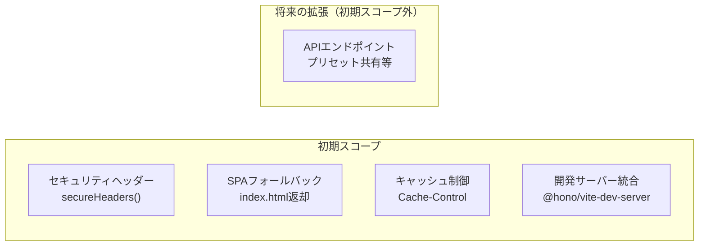

| # | 役割 | 優先度 | 詳細 |
|---|------|--------|------|
| 1 | セキュリティヘッダー | 高 | `secureHeaders()`ミドルウェアでCSP、HSTS、X-Frame-Options等を一元管理。`vercel.json`でなくコードで管理することで、テスト可能かつ開発時も動作する |
| 2 | SPAフォールバック | 高 | React SPAのクライアントサイドルーティング（例: `/timer/:presetId`）を支えるキャッチオールルート |
| 3 | キャッシュ制御 | 中 | ビルド済みアセット（ハッシュ付き）への長期キャッシュ、index.htmlへのno-cache設定 |
| 4 | 開発サーバー統合 | 中 | `@hono/vite-dev-server`でVite HMRとHonoミドルウェアを統合。開発中から本番同等のヘッダー動作を確認可能 |
| 5 | 将来のAPIエンドポイント | 低（初期スコープ外） | プリセット共有リンク生成、OGP画像動的生成等。Hono RPCの型安全性を活かし、コード生成なしでフロントエンド連携 |

#### SSRを採用しない理由

| 観点 | SSR | SPA + 静的配信（採用） |
|------|-----|----------------------|
| オフライン動作 | サーバー接続が必要（PWA目標と矛盾） | SWキャッシュで完全オフライン |
| 初期表示速度 | サーバーレンダリング分だけ速い | SWキャッシュ後はSSRより高速 |
| SEO | 有利 | 不要（タイマーアプリにSEO恩恵なし） |
| 実装複雑性 | 高い（SSR + ハイドレーション） | 低い |
| Service Worker連携 | 複雑（SSRレスポンスのキャッシュ戦略） | シンプル（index.html + アセット） |

### データモデル

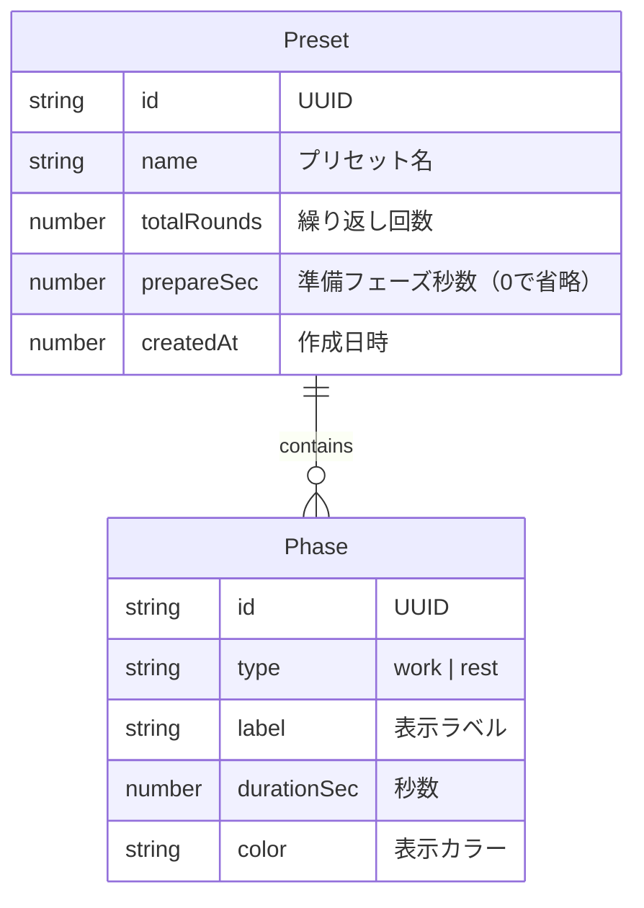

**ストレージ形式**: localStorageにJSON形式で保存

```typescript
// Zodスキーマで定義
const PhaseSchema = z.object({
  id: z.string().uuid(),
  type: z.enum(["work", "rest"]),
  label: z.string(),
  durationSec: z.number().int().positive(),
  color: z.string(),
});

const PresetSchema = z.object({
  id: z.string().uuid(),
  name: z.string(),
  totalRounds: z.number().int().positive(),
  prepareSec: z.number().int().nonnegative(),
  phases: z.array(PhaseSchema).min(1),
  createdAt: z.number(),
});
```

### 状態管理アーキテクチャ（Zustand + Zod）

コンポーネントの状態管理は**Zustand**に移譲する。すべてのストアは**Zodスキーマベース**で定義し、localStorage永続化時のデータ検証を型安全に行う。

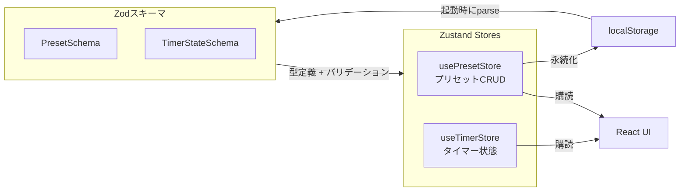

#### ストア設計

| ストア | 責務 | 永続化 |
|---|---|---|
| `usePresetStore` | プリセットの一覧管理・CRUD操作 | localStorage（Zodスキーマでバリデーション後に保存・復元） |
| `useTimerStore` | タイマーの実行状態（現在のフェーズ、残り時間、動作状態等） | なし（揮発性。タイマー停止で初期化） |

#### Zodスキーマとの連携パターン

```typescript
import { create } from "zustand";
import { persist } from "zustand/middleware";

/**
 * プリセットストアの状態スキーマ
 * localStorageからの復元時にZodでバリデーションする
 */
const PresetStoreSchema = z.object({
  presets: z.array(PresetSchema),
});

type PresetStoreState = z.infer<typeof PresetStoreSchema>;

/** プリセットストアのアクション */
type PresetStoreActions = {
  readonly addPreset: (preset: PresetStoreState["presets"][number]) => void;
  readonly removePreset: (id: string) => void;
};

const usePresetStore = create<PresetStoreState & PresetStoreActions>()(
  persist(
    (set) => ({
      presets: [TABATA_PRESET],
      addPreset: (preset) =>
        set((state) => ({ presets: [...state.presets, preset] })),
      removePreset: (id) =>
        set((state) => ({
          presets: state.presets.filter((p) => p.id !== id),
        })),
    }),
    {
      name: "interval-timer-presets",
      // 復元時にZodでバリデーション
      merge: (persisted, current) => {
        const parsed = PresetStoreSchema.safeParse(persisted);
        return parsed.success ? { ...current, ...parsed.data } : current;
      },
    },
  ),
);
```

> **設計判断**: Zustandの`persist`ミドルウェアでlocalStorage永続化を行い、`merge`コールバックでZodバリデーションを挟む。不正なデータ（スキーマ変更後の旧データ等）が混入しても、`safeParse`の失敗でフォールバック（デフォルトのタバタプリセット）が使われる。`useTimerStore`は揮発性のため永続化しない。

### デフォルトプリセット

アプリ初回起動時に**タバタプロトコル**をデフォルトプリセットとして提供する。ユーザーはすぐにタイマーを開始できる。

| 項目 | 値 |
|---|---|
| プリセット名 | Tabata |
| ラウンド数 | 8 |
| 準備フェーズ | 10秒 |
| WORKフェーズ | 20秒 |
| RESTフェーズ | 10秒 |
| 合計時間 | 4分10秒（準備10秒 + (20秒+10秒) × 8ラウンド） |

```typescript
// タバタ デフォルトプリセットの定義
const TABATA_PRESET: z.infer<typeof PresetSchema> = {
  id: "default-tabata",
  name: "Tabata",
  totalRounds: 8,
  prepareSec: 10,
  phases: [
    { id: "work", type: "work", label: "WORK", durationSec: 20, color: "#4CAF50" },
    { id: "rest", type: "rest", label: "REST", durationSec: 10, color: "#FFC107" },
  ],
  createdAt: 0, // ビルトインプリセット
};
```

> **設計判断**: タバタプロトコルは最も普及したHIITフォーマット（20秒全力 + 10秒休憩 × 8セット）であり、初回ユーザーにとって分かりやすい。idに`"default-tabata"`を使用し、UUID生成ではなく固定値とすることで、ビルトインプリセットとユーザー作成プリセットを区別する。

### 画面構成

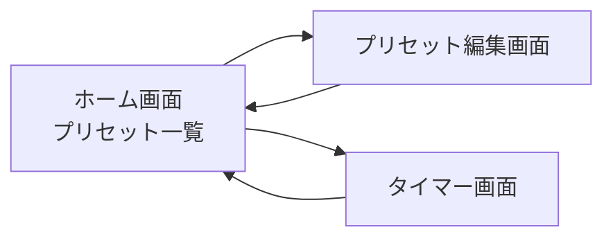

| 画面 | 主な機能 |
|---|---|
| ホーム画面 | プリセット一覧表示、デフォルトプリセット、新規作成ボタン |
| プリセット編集画面 | フェーズの追加・削除・並び替え、ラウンド数設定、プレビュー |
| タイマー画面 | カウントダウン表示、開始/一時停止/リセット、フェーズ進行表示 |

### タイマー画面 UI設計

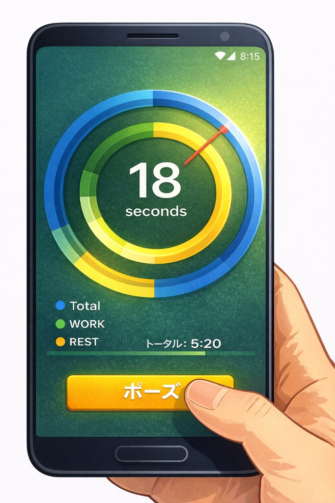

**デザインコンセプト**: マルチリングタイマー（Apple Watchアクティビティリング着想）

#### レイアウト構造

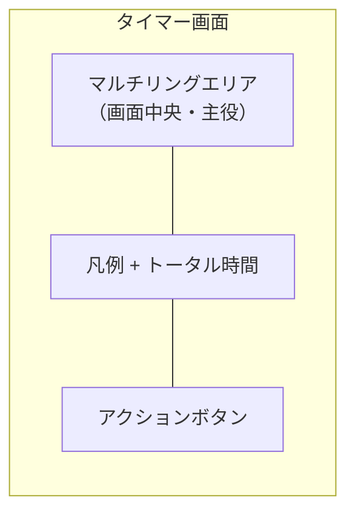

#### マルチリングの構成

SVGベースの同心円リングで、3つの進捗を同時に視覚化する:

| リング | 色 | 表示内容 | 説明 |
|---|---|---|---|
| 外側 | 青（#4A90D9） | Total | ワークアウト全体の進捗 |
| 中間 | 緑（#4CAF50） | WORK | 現在の作業フェーズの残り時間 |
| 内側 | 黄/橙（#FFC107） | REST | 現在の休憩フェーズの残り時間 |

- **中央テキスト**: 現在のフェーズの残り秒数を大きく表示（例: "18 seconds"）
- 各リングの円弧の長さ（塗り進み具合）で進捗を表現。満タン→空になるにつれ円弧が短くなる
- リングは `stroke-dasharray` / `stroke-dashoffset` を `@react-spring/web` の `useSpring` + `animated.circle` でスプリング物理アニメーション描画

#### 情報表示エリア

```
● Total   ● WORK   ● REST       トータル: 5:20
```

- 色付き丸印（●）による凡例で、各リングの意味を明示
- トータル残り時間を右寄せで表示

#### アクションボタン

| 状態 | ボタン表示 | アクション |
|---|---|---|
| 停止中 | 「スタート」（緑） | タイマー開始 |
| 動作中 | 「ポーズ」（黄） | 一時停止 |
| 一時停止中 | 「再開」（緑） + 「リセット」（グレー） | 再開 or リセット |

- ボタンは画面下部に固定配置、親指で押しやすい大きめサイズ
- ワークアウト中は誤操作を防ぐため、リセットボタンは一時停止後のみ表示

#### ビジュアルテーマ

| 要素 | 仕様 |
|---|---|
| 背景色 | ダークグリーン（グラデーション） |
| フォント | 残り秒数は太字サンセリフ、大サイズ |
| 配色 | 高コントラスト（暗い背景 + 明るいリング色） |
| フェーズ切替 | 背景色をフェーズに応じて変化（WORK=緑系、REST=暖色系） |

### 処理フロー

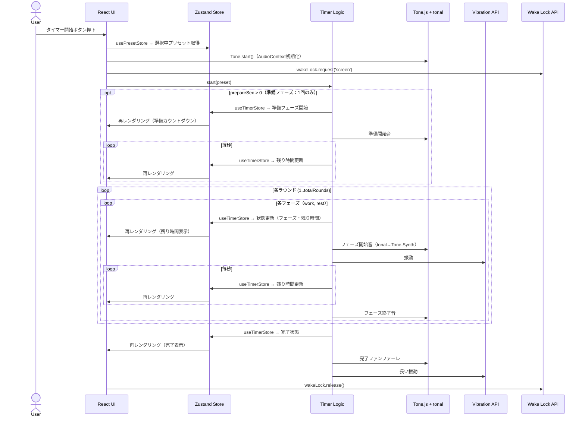

### タイマーの精度設計

ブラウザの`setInterval`はバックグラウンドタブでスロットリングされる問題がある。対策として:

1. **`requestAnimationFrame` + 経過時間計算**: フォアグラウンド時はrAFベースで高精度に動作
2. **Web Worker**: バックグラウンドでもタイマーが止まらないようWorkerスレッドで時間管理
3. **`visibilitychange`イベント**: タブ復帰時に経過時間を補正

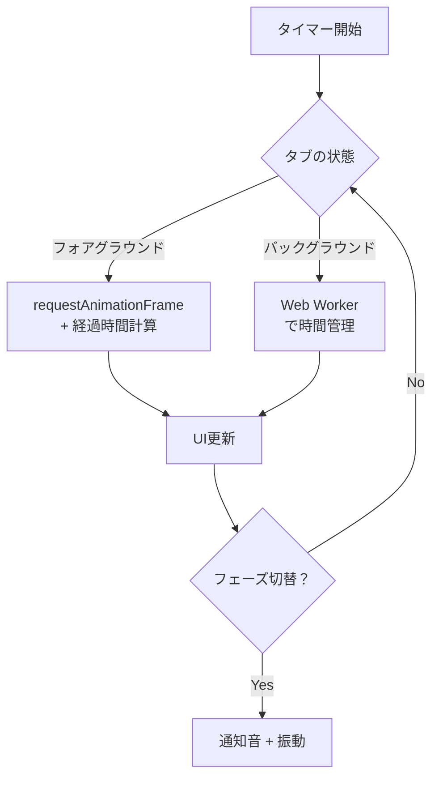

### アニメーション戦略（@react-spring/web）

UIアニメーションは**@react-spring/web**のスプリング物理エンジンで統一する。CSSアニメーションでは実現しにくい「自然な弾力感」をすべてのUI遷移に適用する。

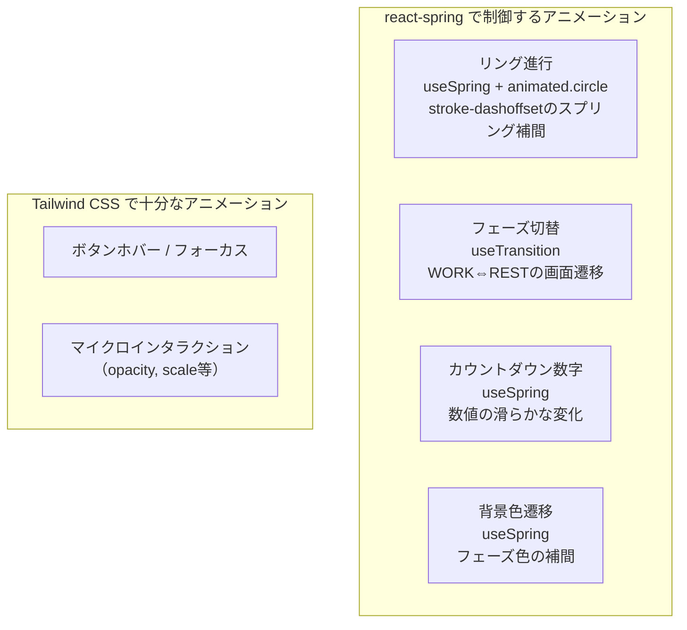

#### 使い分けの原則

| 対象 | 技術 | 理由 |
|---|---|---|
| リング進行（SVG） | `useSpring` + `animated.circle` | stroke-dashoffsetをスプリング物理で補間。残り時間の変化に弾力感が出る |
| フェーズ切替トランジション | `useTransition` | WORK→RESTのコンポーネント切替を、フェードイン/スライドで自然に遷移 |
| カウントダウン数字 | `useSpring` + 数値補間 | 大きく表示される秒数が滑らかに変化 |
| 背景色の遷移 | `useSpring` + 色補間 | 緑系→暖色系のグラデーション遷移をスプリングで制御 |
| ボタンホバー・フォーカス | Tailwind CSS `transition` | シンプルなマイクロインタラクションはCSSで十分 |

#### リングアニメーションの実装方針

```typescript
import { useSpring, animated } from "@react-spring/web";

/**
 * マルチリングの1本分。残り時間の割合に応じてリングが減少する。
 * スプリング物理により、急なフェーズ切替でも滑らかに遷移する。
 */
const AnimatedRing = ({
  radius,
  progress,
  color,
}: {
  readonly radius: number;
  readonly progress: number;
  readonly color: string;
}) => {
  const circumference = 2 * Math.PI * radius;
  const styles = useSpring({
    strokeDashoffset: circumference * (1 - progress),
    stroke: color,
    config: { tension: 120, friction: 14 },
  });

  return (
    <animated.circle
      cx="50%"
      cy="50%"
      r={radius}
      fill="none"
      strokeWidth={12}
      strokeDasharray={circumference}
      strokeLinecap="round"
      style={styles}
    />
  );
};
```

> **設計判断**: react-springを選定した理由は3つ。(1) SVGの`stroke-dashoffset`をスプリング物理で直接アニメーションできる（CSSのtransitionでは線形的で機械的）、(2) Zustandと同じpmndrsエコシステムで親和性が高い、(3) `@react-spring/web`のみで軽量（フルバンドル不要）。

### 音声通知アーキテクチャ

フェーズ切替や完了時の通知音を、**Tone.js + tonal による作曲的アプローチ**で生成する。音声ファイルを同梱せず、コードでシンセサイズすることでバンドルサイズを抑え、オフライン環境でも確実に動作する。

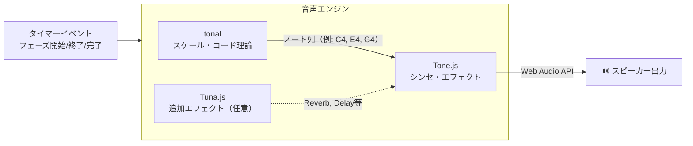

#### 各ライブラリの役割分担

| ライブラリ | 役割 | 具体的な使い方 |
|---|---|---|
| **tonal** | 音楽理論データの生成 | ダイアトニックスケール（例: Cメジャー）内のノートを取得し、通知音のメロディ・コードを構成 |
| **Tone.js** | 音の生成・再生・スケジューリング | `Tone.Synth`でシンセ音を鳴らす。`Tone.Transport`でタイマーと同期した正確なタイミング制御 |
| **Tuna.js** | エフェクト追加（将来拡張） | Tone.js内蔵エフェクトで不足する場合に、Reverb / Chorus / Bitcrusher等を追加 |

#### 通知音の設計方針

| イベント | サウンドデザイン | 例 |
|---|---|---|
| 準備開始 | 短いベル音（単音） | C5を0.2秒 |
| WORKフェーズ開始 | 上昇フレーズ（3音） | C4→E4→G4（Cメジャートライアド） |
| RESTフェーズ開始 | 下降フレーズ（2音） | G4→C4 |
| ラウンド完了 | コードストラブ | Cメジャーコード全音 |
| 全ラウンド完了 | 達成感のあるファンファーレ | C4→E4→G4→C5（アルペジオ） |

> **設計判断**: tonal でダイアトニック制約を適用することで、どの通知音も調和的に聞こえる。素のWeb Audio APIで波形を直接操作するより、Tone.jsのシンセ抽象化を使う方が開発効率が高く、音質も優れる。

#### AudioContextの初期化

ブラウザのオートプレイポリシーにより、`AudioContext`はユーザーインタラクション（タップ/クリック）後に初期化する必要がある:

```typescript
// タイマー開始ボタンのハンドラで初期化
const handleStart = async () => {
  await Tone.start(); // AudioContextをresumeする
  startTimer(preset);
};
```

### 画面スリープ防止（Wake Lock API）

タイマー動作中にスマートフォンの画面がスリープすると、ユーザーが残り時間を確認できない。**Wake Lock API**を使い、タイマー動作中は画面を点灯し続ける。

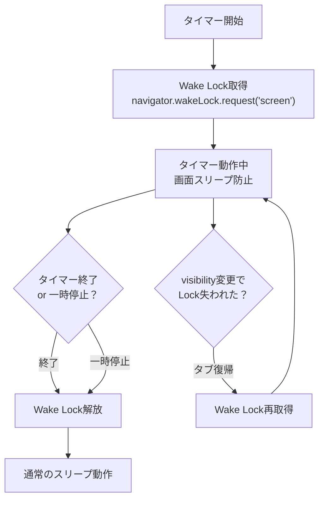

| 項目 | 仕様 |
|---|---|
| 取得タイミング | タイマー開始時 |
| 解放タイミング | タイマー完了時、一時停止時、リセット時 |
| 復帰対応 | `visibilitychange`イベントでタブ復帰時にWake Lockを再取得 |
| フォールバック | Wake Lock API非対応ブラウザでは何もしない（タイマー自体は動作を継続） |

> **設計判断**: Wake Lock APIは[ブラウザサポートが広がっている](https://caniuse.com/wake-lock)。PWAのホーム画面起動時は特にスリープしやすいため、初期スコープに含める判断をした。非対応ブラウザでも致命的な影響はない（タイマーは動作し続ける）。

### iOS ロック画面・バックグラウンドでの動作（ベストエフォート）

ロック画面や他アプリへの切り替え時も、タイマーとサウンドが止まらないようにするため、以下を採用している。

| 対策 | 内容 |
|------|------|
| interval を止めない | `visibilitychange` で `hidden` のときも `setInterval` を clear しない。プラットフォームが JS をサスペンドしなければ tick とサウンドが発火し続ける。 |
| 復帰時の補正 | `visible` 復帰時、hidden 時点の状態スナップショットと経過秒数から `syncFromElapsed` で表示を一括補正。コールバック（サウンド）は発火させず、ずれのみ解消する。 |
| AudioContext resume | 復帰時に `resumeAudioContext()` を呼び、iOS 等で suspended になった AudioContext を再開する。 |
| Wake Lock 再取得 | タブ復帰時に `visibilitychange` で Wake Lock を再取得（上記「復帰対応」の通り）。 |

**制約**: iOS ではロック・バックグラウンド時に WebView/PWA の JavaScript がサスペンドまたは強くスロットルされるため、**PWA のみの構成では「ロック中・バックグラウンドで確実にタイマーとサウンドを動かす」ことは保証できない**。あくまでベストエフォートであり、確実性を求める場合は Capacitor 等でネイティブ化し Background Modes（Audio）を有効にする案を検討する。

## 5. 検討した代替案

| 案 | 概要 | 利点 | 欠点 | 採用しなかった理由 |
|----|------|------|------|-------------------|
| **A: Hono + React SPA（採用）** | Honoをミドルウェア層+将来API基盤として使い、ReactでSPA構築。静的配信はVercel CDN | 軽量、PWA親和性高い、セキュリティヘッダーをコード管理、将来のAPI拡張が型安全 | Hono単独では静的配信不可（Vercel CDN依存） | - |
| **B: Next.js** | Next.jsのApp Routerで構築 | Vercel最適化、SSR/SSG内蔵、豊富なエコシステム | フレームワークが重い、PWA対応にnext-pwaが必要、技術スタック要件と不一致 | ユーザー指定の技術スタック（Hono + React）と合わない。タイマーアプリにSSR/SSGの恩恵が薄い |
| **C: Vite + React（静的SPA）** | Viteのみで静的SPAとしてビルド、Vercelに静的デプロイ | 最もシンプル、ビルド高速 | サーバーサイドの拡張性がない、APIエンドポイント追加不可 | 将来的にサーバーサイド処理（共有リンク生成等）を追加する可能性を考慮。Honoを入れておくことで拡張性を確保 |

## 6. 横断的関心事

### テスト戦略

| レイヤー | 対象 | ツール |
|---|---|---|
| ユニット | タイマーロジック、Zodスキーマ検証、Zustandストア | Vitest |
| コンポーネント | React UIコンポーネント | Vitest + Testing Library |
| E2E | タイマーの開始→完了フロー | Playwright |

**優先度**: タイマーロジックのユニットテストを最優先。UIは手動確認でカバーし、安定後にE2Eを追加。

### 監視・可観測性

- **Vercel Analytics**: ページロード時間、Core Web Vitals
- **Lighthouse CI**: PWAスコアの継続的監視（CI/CDパイプラインで実行）
- **エラーハンドリング**: Service Worker登録失敗時のフォールバック表示

本アプリはクライアントサイドで完結するため、サーバーサイドの監視は最小限。

### セキュリティ・プライバシー

| リスク | 対策 |
|---|---|
| localStorageへの不正アクセス | 個人情報を保存しない設計（タイマー設定のみ） |
| Service Workerの乗っ取り | HTTPS必須（Vercelがデフォルトで対応） |
| XSS | Reactのデフォルトエスケープ + Honoの`secureHeaders()`によるCSPヘッダー設定 |

プライバシーリスクは低い（ユーザーデータをサーバーに送信しない）。セキュリティヘッダーの実装はHonoのミドルウェアで一元管理する（詳細は「Honoの役割定義」を参照）。

### 移行・廃止計画

- **データ移行**: Zustandの`persist`ミドルウェアの`version`オプションと`migrate`関数で対応。localStorageのスキーマ変更時はZodバリデーションでフォールバック（デフォルトプリセットに復帰）、または`migrate`関数で旧→新スキーマへ変換
- **廃止時**: PWAはユーザーが明示的にアンインストールするまで動作し続ける。Service Workerのunregisterスクリプトを配信することで、必要に応じてクリーンアップ可能

## 7. 未解決の質問

- [x] ~~デフォルトプリセットとして、どのようなワークアウトパターンを用意するか？~~ → **タバタプロトコル（20秒WORK + 10秒REST × 8ラウンド）を採用**。最も普及したHIITフォーマットで初回ユーザーにも分かりやすい。詳細は「デフォルトプリセット」セクションを参照
- [x] ~~音声通知のサウンドファイルは自作するか、フリー素材を利用するか？~~ → **Tone.js + tonal による作曲的アプローチを採用**。音声ファイル不要でコードからシンセサイズ。tonal のダイアトニック制約で調和的な通知音を生成。詳細は「音声通知アーキテクチャ」セクションを参照
- [x] ~~Hono側でSSRを行うか、純粋にSPA + 静的配信とするか？~~ → **SPA + 静的配信を採用**。PWAのオフラインファースト設計とSSRは相性が悪い（SSRはサーバー接続必須、SWキャッシュ後はSSRより高速）。詳細は「Honoの役割定義 > SSRを採用しない理由」を参照
- [x] ~~タイマー動作中の画面スリープ防止（Wake Lock API）は初期スコープに含めるか？~~ → **初期スコープに含める**。PWAホーム画面起動時はスリープしやすく、タイマーアプリでは致命的なUX問題になる。非対応ブラウザではフォールバック（何もしない）。詳細は「画面スリープ防止」セクションを参照

## 8. 参考資料

- [Hono公式ドキュメント](https://hono.dev/)
- [Hono on Vercel](https://vercel.com/docs/frameworks/backend/hono)
- [Hono Secure Headers Middleware](https://hono.dev/docs/middleware/builtin/secure-headers)
- [Vite PWA Plugin](https://vite-pwa-org.netlify.app/)
- [Web Audio API - MDN](https://developer.mozilla.org/en-US/docs/Web/API/Web_Audio_API)
- [Vibration API - MDN](https://developer.mozilla.org/en-US/docs/Web/API/Vibration_API)
- [Wake Lock API - MDN](https://developer.mozilla.org/en-US/docs/Web/API/Screen_Wake_Lock_API)
- [Service Worker API - MDN](https://developer.mozilla.org/en-US/docs/Web/API/Service_Worker_API)
- [shadcn/ui](https://ui.shadcn.com/) - beautifully-designed, accessible components（Radix UI + Tailwind CSS）
- [Tailwind CSS](https://tailwindcss.com/) - utility-first CSS framework
- [Zustand](https://zustand.docs.pmnd.rs/) - bear necessities for state management in React
- [Biome](https://biomejs.dev/) - one toolchain for your web project（linter + formatter）
- [react-spring](https://www.react-spring.dev/) - spring physics based React animation library（pmndrs）
- [tsgo](https://github.com/microsoft/typescript-go) -TypeScriptのネイティブポート開発用ステージングリポジトリ（Microsoft公式）
- [Tone.js](https://tonejs.github.io/) - Web Audio framework for creating interactive music
- [tonal](https://github.com/tonaljs/tonal) - Music theory library for JavaScript
- [Tuna.js](https://github.com/Theodeus/tuna) - Audio effects library for Web Audio API
- [タバタプロトコル](https://ja.wikipedia.org/wiki/%E3%82%BF%E3%83%90%E3%82%BF%E5%BC%8F%E3%83%88%E3%83%AC%E3%83%BC%E3%83%8B%E3%83%B3%E3%82%B0) - 田畑泉博士による高強度インターバルトレーニング

---

## 9. タスクブレイクダウン

### タスク一覧

| # | タスク名 | 概要 | 見積もり | 分類 | 先行タスク | ブランチ |
|---|---|---|---|---|---|---|
| T0 | Design Docs PR | タスクブレイクダウン情報の追加 | S | - | - | `feature/interval-timer/00-design-docs` |
| T1 | プロジェクト初期構築 | Vite + React + Hono + Biome + Tailwind + shadcn/ui のセットアップ | S | IMPLEMENT | T0 | `feature/interval-timer/01-project-setup` |
| T2 | データスキーマ定義 | Zodスキーマ（Phase, Preset）+ デフォルトTabataプリセット + 型エクスポート | S | INTERFACE | T1 | `feature/interval-timer/02-data-schema` |
| T3 | 状態管理ストア | Zustand usePresetStore（persist + Zod merge）+ useTimerStore + ユニットテスト | M | IMPLEMENT | T2 | `feature/interval-timer/03-state-store` |
| T4 | タイマーエンジン | rAF + Web Worker + visibilitychange + フェーズ進行ロジック + ユニットテスト | M | IMPLEMENT | T3 | `feature/interval-timer/04-timer-engine` |
| T5 | ホーム画面 | App shell + ルーティング + プリセット一覧 + 新規作成ボタン | M | IMPLEMENT | T3 | `feature/interval-timer/05-home-screen` |
| T6 | タイマー画面 | マルチリングSVG + react-spring アニメーション + アクションボタン + カウントダウン | L | IMPLEMENT | T4, T5 | `feature/interval-timer/06-timer-screen` |
| T7 | プリセット編集画面 | フェーズ追加・削除・並び替え + ラウンド数設定 + Zodバリデーション | M | IMPLEMENT | T5 | `feature/interval-timer/07-preset-editor` |
| T8 | サウンド・通知 | Tone.js + tonal 音声エンジン + Vibration API + Wake Lock API | M | IMPLEMENT | T4 | `feature/interval-timer/08-sound-notify` |
| T9 | PWA対応 | Vite PWA Plugin + Service Worker + マニフェスト + オフライン動作確認 | M | IMPLEMENT | T6, T7, T8 | `feature/interval-timer/09-pwa-setup` |

> **注**: T1（scaffolding）はCLI自動生成のboilerplateが大半のため、300行超を許容する

### 依存関係図

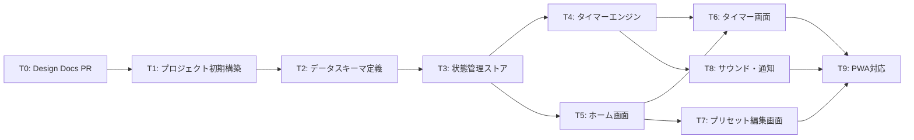

### ブランチ戦略（スタック方式）

依存グラフにはT3からの分岐があるが、**スタック方式で線形化**する。スタックでは各ブランチが前のすべての変更を累積的に含むため、分岐があっても問題ない。

| ブランチ | 親 | マージ順 | 備考 |
|---|---|---|---|
| `feature/interval-timer/00-design-docs` | `main` | 0 | Design Docs PR（設計レビュー用） |
| `feature/interval-timer/01-project-setup` | `/00-design-docs` | 1 | scaffolding（300行超許容） |
| `feature/interval-timer/02-data-schema` | `/01-project-setup` | 2 | INTERFACE: テスト不要 |
| `feature/interval-timer/03-state-store` | `/02-data-schema` | 3 | |
| `feature/interval-timer/04-timer-engine` | `/03-state-store` | 4 | |
| `feature/interval-timer/05-home-screen` | `/04-timer-engine` | 5 | |
| `feature/interval-timer/06-timer-screen` | `/05-home-screen` | 6 | |
| `feature/interval-timer/07-preset-editor` | `/06-timer-screen` | 7 | |
| `feature/interval-timer/08-sound-notify` | `/07-preset-editor` | 8 | |
| `feature/interval-timer/09-pwa-setup` | `/08-sound-notify` | 9 | |

> **整合性チェック**: スタック方式では各ブランチが累積的に全変更を含む
> - T5（T3依存）→ /05 は /03 以前の全変更を含む ✅
> - T6（T4+T5依存）→ /06 は /04 と /05 の全変更を含む ✅
> - T8（T4依存）→ /08 は /04 以前の全変更を含む ✅

### クリティカルパス

T0 → T1 → T2 → T3 → T4 → T6 → T9

### 見積もりサマリー

- 総タスク数: 10（T0含む）
- S（小）: 3件（T0, T1, T2）
- M（中）: 6件（T3, T4, T5, T7, T8, T9）
- L（大）: 1件（T6）

---

## 更新履歴

| 日付 | 変更内容 | 理由 |
|------|----------|------|
| 2026-02-15 | 初版作成 | - |
| 2026-02-15 | タイマー画面UI設計を追加 | コンセプトUI画像に基づくマルチリングデザインの詳細仕様 |
| 2026-02-15 | Honoの役割定義を追加、アーキテクチャ図を修正 | ACE分析によりVercelデプロイ時のserveStatic無効化を確認。Honoの責務を「薄いミドルウェア層+将来の拡張ハブ」に明確化。SSR不採用を決定 |
| 2026-02-15 | デフォルトプリセット（タバタ）を決定、音声通知アーキテクチャ（Tone.js + tonal）を追加、画面スリープ防止（Wake Lock API）を初期スコープに追加 | 未解決の質問3件を解決。音声はファイル同梱ではなくシンセサイズ方式を採用。タバタは最も普及したHIITフォーマット |
| 2026-02-15 | UIコンポーネントにshadcn/uiを採用、スタイリングをCSS ModulesからTailwind CSSに変更 | shadcn/uiはRadix UIベースのアクセシブルなコンポーネント群。コードコピー方式でフルカスタマイズ可能。Tailwind CSSはshadcn/uiの基盤として必須 |
| 2026-02-15 | 開発ツールチェーン確定（Biome / tsgo）、状態管理にZustandを採用、状態管理アーキテクチャセクションを追加 | Biomeでリンター+フォーマッターを統一。tsgoで高速型チェック。ZustandストアはZodスキーマベースで型安全なlocalStorage永続化を実現 |
| 2026-02-15 | アニメーションに@react-spring/webを採用、アニメーション戦略セクションを追加 | スプリング物理でSVGリング進行・フェーズ切替・カウントダウンを滑らかに制御。Zustandと同じpmndrsエコシステムで親和性が高い |
| 2026-02-15 | タスクブレイクダウン（10タスク、スタック方式）を追加 | ADE Phase 1完了。T0-T9の依存関係・ブランチ戦略・INTERFACE/IMPLEMENT分類を策定 |
| 2026-02-15 | prepareフェーズをPresetのトップレベルフィールド（prepareSec）に分離。phases配列はwork/restのみ。処理フローを修正 | phases配列内のprepareが毎ラウンド実行される不具合を修正。合計時間計算（4:10）との矛盾を解消 |
